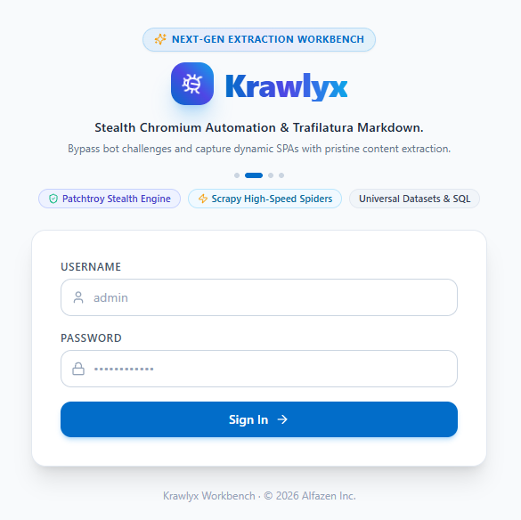

# Krawlyx

A self-hosted web scraping workbench: paste URLs, pick a crawl engine from an
admin-curated pool, run batch crawls on demand or on a cron schedule, and land
results in SQLite or as auto-splitting CSV/XLSX files in a shared folder.

Free and open source (Apache 2.0) — every dependency is open source and runs locally;
no paid APIs or third-party cloud lock-in.

---

## Overview



> 📖 **Looking for a full tour?** Explore the [**Interactive UI & Feature Gallery (7 Modules)**](docs/0008-get-started.md#7-workbench-visual-tour) in the Quick Start Guide.

---

## Status

**Production Stable (`v2.1.0`)** — All core development milestones (M1–M6) and post-milestone workbench expansions are fully delivered, validated, and hardened. Krawlyx operates as an all-in-one web scraping workbench featuring:
- **Triple Crawl Engine Suite**: Built-in native support for **Patroy** (default Go engine), **Playtrafi** (Chromium browser engine), and **Scrapy** (async HTTP subprocess).
- **Persistent Datasets & Universal Schema**: Dynamic SQLite schema extraction, structured JSON-LD / HTML table capture, and zero-loss persistence.
- **In-Browser SQL Console**: Interactive SQL workspace with live preview, dynamic schema inspection, and instant data transformations.
- **Dataset Operations & Multi-Job Merger**: Column union merging, single-tier pagination, regex filtering, in-place splitting, and streaming CSV/XLSX export with size-based chunk rollover.
- **Security & Ops**: SuperAdmin role hierarchy, in-process APScheduler cron engine, SSRF guardrails default-on, per-host throttling, rotating job logs, and production-ready Docker Compose & Synology NAS deployments.

## Quick Start & Verification

```bash
# 1. Verify env and dependencies
python -m app.core.doctor

# 2. Start the API
uvicorn app.main:app --port 4040 --reload

# 3. Run the full test suite (no live network required for core tests)
pytest -m "not integration" -q

# 4. Check settings are configured
curl -H "Cookie: session=..." http://localhost:4040/api/settings | jq '.ssrf_guard_enabled, .ssrf_allow_list, .admin_contact_email'
```
See [`AGENTS.md`](AGENTS.md) for the engineering contract used by AI agents and humans.

## Technology Stack

| Layer | Choice |
| --- | --- |
| Backend | Python · FastAPI · SQLAlchemy · APScheduler |
| Frontend | React + TypeScript + Vite + Tailwind CSS + shadcn/ui |
| Engines | Patroy (default), Playtrafi, Scrapy (pluggable adapter registry) |
| Storage | SQLite (WAL) + CSV/XLSX export with size-based splitting |

## Crawl Engines (Patroy, Playtrafi & Scrapy)

Krawlyx provides built-in crawl engines tailored for different scraping tasks, with **Patroy set as the primary default**:

- **⚡ [Patroy](docs/0013-engines-comparison.md) (Default Engine)**: Ultra-fast, lightweight compiled Go engine (<50MB RAM) featuring sub-50ms instant cold starts, native Go-Rod + Stealth headless Chromium automation, full client-side JavaScript rendering (React/Vue/Next.js DOM hydration), zero-config portable binary self-downloading, and native HTML `<table>` and Schema.org JSON-LD extraction. The recommended first choice for modern web scraping and e-commerce listings.
- **🛡️🐴 [Playtrafi](https://github.com/marcuz-apl/playtrafi)** ([Docs](docs/0013-engines-comparison.md), PyPI: `playtrafi`): Undetected Patchright headless Chromium browser engine paired with Trafilatura for pristine Markdown extraction, full client-side JavaScript execution, Next.js/React hydration support, and automatic HTTP fallback. Best for dynamic, text-heavy editorial pages and article archives.
- **🚀 [Scrapy](https://github.com/scrapy/scrapy)**: Ultra-fast, lightweight asynchronous HTTP engine running in an isolated subprocess. Best for large-scale bulk scraping, server-rendered HTML, and deep link crawling.

## SuperAdmin Password Recovery

If you ever forget the password for the SuperAdmin (`admin`) account:

```bash
# Interactive password reset (prompts for new password securely):
python scripts/reset_admin_password.py

# Or specify the new password directly:
python scripts/reset_admin_password.py myNewSecurePassword123
```

This utility updates the database credentials immediately, restores full `superadmin` privileges, and allows instant sign-in without server downtime.

## Documentation

All project documentation, architectural decision records, implementation plans, and walkthroughs are organized chronologically in `docs/`:

### Milestone Architecture & Guides
- `0001` — [ADR: Web Architecture Decision (NiceGUI vs Flet)](docs/0001-nicegui-vs-flet.md)
- `0002` — [M1: Project Skeleton & Database Architecture](docs/0002-m1-skeleton.md)
- `0003` — [M2: Pluggable Engine Adapter Contract](docs/0003-m2-engines.md)
- `0004` — [M3: Async Worker Pool & Job Queue](docs/0004-m3-runner.md)
- `0005` — [M4: Streaming CSV/XLSX Exporter & File Splitting](docs/0005-m4-export.md)
- `0006` — [M5: APScheduler Cron Scheduling Engine](docs/0006-m5-scheduler.md)
- `0007` — [M6: Security, SSRF Guard & Diagnostics Hardening](docs/0007-m6-hardening.md)
- `0008` — [🚀 Get Started Guide](docs/0008-get-started.md)

### Universal Workbench Features & Deployment Guides
- `0009` — [Universal Custom Schema & Persistent Datasets](docs/0009-custom-schema-and-datasets.md) — Arbitrary schema extraction and SQLite persistence.
- `0010` — [Universal SQL Query & Transform Console](docs/0010-universal-sql-console.md) — In-browser dynamic SQL transforms and data cleaning.
- `0011` — [Multi-Worker Rate Limiting & Engine Hardening](docs/0011-rate-limiting-and-crawler-hardening.md) — Staggered sessions, 25s timeouts, and HTTP fallbacks.
- `0012` — [Multi-Job Dataset Merger](docs/0012-multi-job-merger.md) — Multi-job selection, column union, and unified export.
- `0013` — [⚙️ Crawl Engines Comparison: Patroy vs. Playtrafi vs. Scrapy](docs/0013-engines-comparison.md) — Deep dive into engine differences, speeds, and use cases.
- `0014` — [Dataset Filters, Splitting, Sorting & Maintenance](docs/0014-dataset-filters-splitting-sorting-maintenance.md) — Dataset browser operations and maintenance.
- `0015` — [🐳 Production Deployment Guide (Docker, Compose & Synology NAS)](docs/0015-production-deployment-guide.md) — Complete 1-click Docker, Compose, and DSM Reverse Proxy guide.

## Versioning

This repo adheres to **Alfazen Versioning (Connected Prefix Standard)**:
- Stored directly in the tracked root `VERSION` file as `v<m.n.p>+<yymmddc>` (e.g. `v2.1.0+2609044`).
- Complies strictly with SemVer 2.0.0 (Rule #10) build metadata (`+` delimiter).
- Every commit subject line is automatically prefixed with the connected identifier:
  `v<m.n.p>+<yymmddc> <type>(<scope>): <subject>`
- Enable repository Git hooks after cloning with:

```sh
git config core.hooksPath .githooks
```

## Credits & Acknowledgements

Krawlyx is powered by core in-house engines and outstanding open-source projects:

- **[Patroy](https://github.com/marcuz-apl/patroy)** — Lightweight, high-speed Go native browser extraction engine with clean Markdown generation.
- **[Playtrafi](https://github.com/marcuz-apl/playtrafi)** ([PyPI](https://pypi.org/project/playtrafi/)) — Standalone Python headless browser automation engine with context pooling and Trafilatura structured extraction.
- **[Scrapy](https://github.com/scrapy/scrapy)** — The battle-tested fast high-level web crawling and scraping framework for Python.
- **[Go-Rod](https://github.com/go-rod/rod)** & **[Patchright](https://github.com/Kaliiiiiiiiii-Vinyzu/patchright)** — Headless browser drivers powering native and Python browser automation.
- **[Trafilatura](https://github.com/adbar/trafilatura)** — High-precision web text and metadata extraction library.
- **[FastAPI](https://github.com/fastapi/fastapi)** — Modern, fast (high-performance) web framework for building APIs.
- **[shadcn/ui](https://ui.shadcn.com/)** & **[Tailwind CSS](https://tailwindcss.com/)** — UI components and responsive styling.

## License

This project is licensed under the [Apache License 2.0](LICENSE). Free to use, modify, and distribute for personal and commercial applications.
