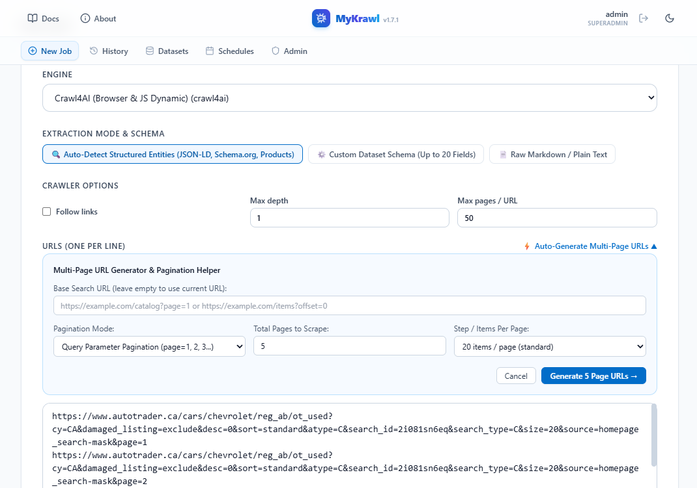
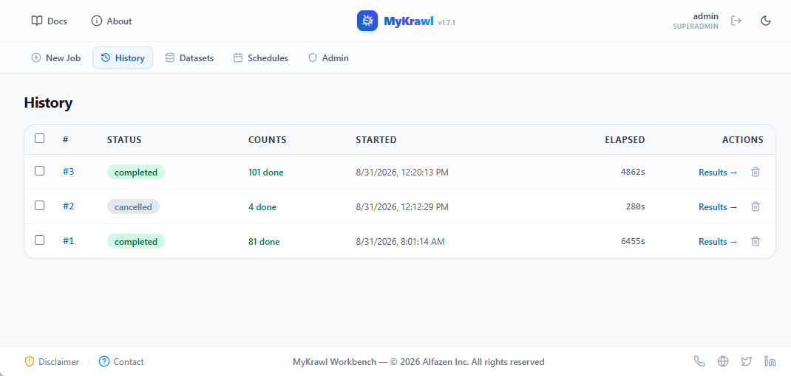
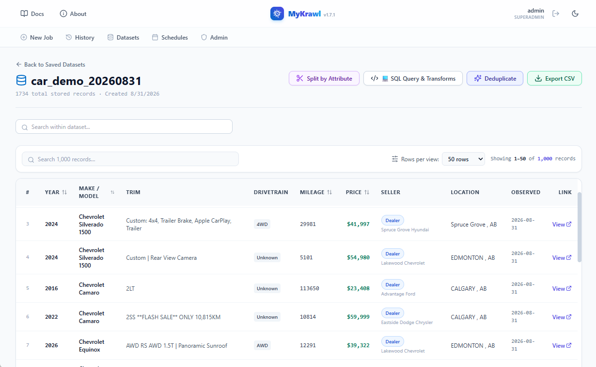
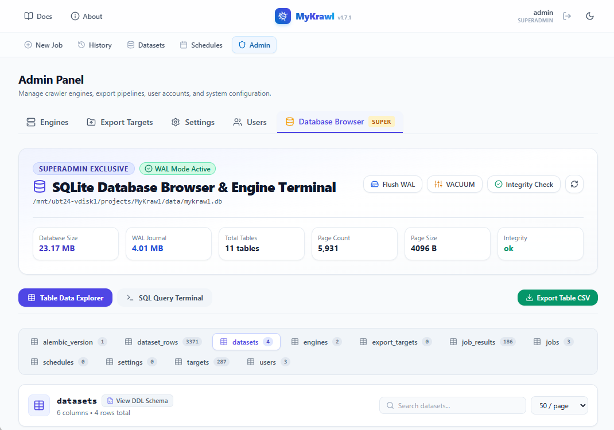
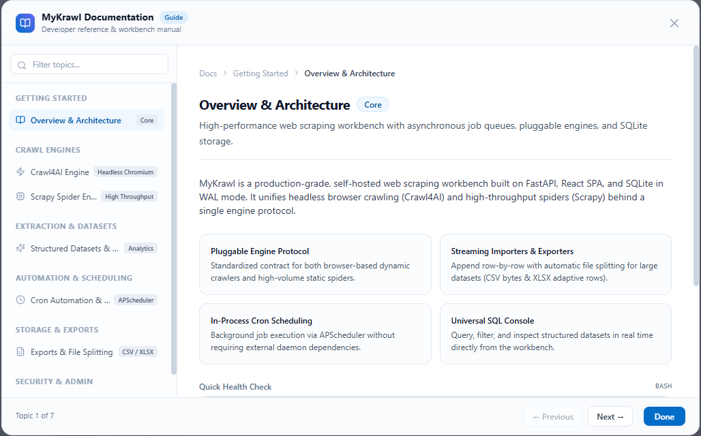

# Get Started Quickly — MyKrawl

## 1. First-time setup (30 seconds)

```bash
# Inside backend/
python -m venv .venv && source .venv/Scripts/activate   # or .venv/bin/activate (Linux)
pip install -e "."
playwright install chromium
crawl4ai-setup
```

Copy `.env.example` → `.env` and fill at minimum:

```env
MYKRAWL_SECRET_KEY=$(openssl rand -hex 32)
MYKRAWL_ADMIN_USER=admin
MYKRAWL_ADMIN_PASSWORD=<strong-password>
```

First run bootstraps the SQLite DB (`data/mykrawl.db`) and admin user.

## 2. Verify environment

```bash
python -m app.core.doctor
```

Expected: `all checks passed` (Python ≥3.11, SQLite, DB writable, log dir writable, engine registry, admin user present).

## 3. Start the server

```bash
uvicorn app.main:app --port 4040 --reload
```

- API: `http://localhost:4040`
- Static SPA served at `/` in production; use Vite dev server (`npm run dev`) for frontend work (proxies `/api` → `:4040` on port `:4039`).

## 4. Basic usage flow

1. **Login** (`/api/auth/login`) with bootstrap admin → receive session cookie.
2. **Admin**: register an engine instance (`POST /api/engines`) — e.g. `crawl4ai` with `{"headless": true}` or `scrapy` with `{"concurrency": 2}`.
3. **Enable** the instance (`PUT /api/engines/{id}/pool` or toggle via settings) so it appears in the user pool.
4. **Runner** (`/` or SPA): paste URLs (one per line), pick pooled engine, submit (`POST /api/jobs`).
5. **Watch progress**: live target table (`GET /api/jobs/{id}`); per-target status updates via polling (≤2 s).
6. **Results** (`GET /api/jobs/{id}/results`): paginated `CrawlRecord` rows; click for full markdown/content; download `.md` or `.json` per record; export whole job to JSON.
7. **Export targets** (`POST /api/export-targets`): define folder mode (`csv`/`xlsx`) + `path` + `split_size_mb` (default 40, min 1).
8. **Schedules** (`POST /api/schedules`): named cron + timezone + job template; fired jobs visible in history (`GET /api/schedules/{id}/runs`); overlapping runs prevented (`FR-SCH-03`).

## 5. Security defaults (M6)

| Guard | Default | Config env key |
|---|---|---|
| SSRF guard | `on` (block loopback/private/link-local/metadata) | `MYKRAWL_SSRF_GUARD_ENABLED` |
| SSRF allow-list | empty (block-by-default) | `MYKRAWL_SSRF_ALLOW_LIST` |
| robots.txt compliance | `on` | `MYKRAWL_ROBOTS_TXT_ENABLED` |
| Per-domain rate limit | `1.0` s | `MYKRAWL_PER_DOMAIN_INTERVAL_S` |
| Content size cap | `5` MB | `MYKRAWL_CONTENT_SIZE_CAP_BYTES` |
| User-Agent | `MyKrawl/0.1 (+{email}) via {engine}` (`NFR-05`) | `MYKRAWL_ADMIN_CONTACT_EMAIL` |

When `SSRF_ALLOW_LIST` is non-empty, **only** listed hosts pass (suffix match, case-insensitive). Empty list = standard block-by-default.

## 6. Testing

```bash
# Fast (no live network, no integration)
pytest -m "not integration" -q

# Full suite
pytest -v

# Individual M6 contracts
python -m pytest tests/test_ssrf_allow_list.py -v
python -m pytest tests/test_per_job_log.py -v
python -m pytest tests/test_scrapy_engine.py -v
```

No live network in tests: engine adapters use monkeypatched fixtures / canned payloads (`tests/fixtures/`). Scrapy health/template tests monkeypatch `sys.modules["scrapy"]`.

## 7. Workbench Visual Tour

### 1. Multi-Worker Anti-Ban Crawl Runner

Configure batch target URLs, toggle randomized multi-worker session gaps (0.5m–10m), choose between Crawl4AI and Scrapy, or define custom structured extraction schemas.

### 2. Job History & Live Telemetry

Monitor running crawler sessions in real-time with granular execution metrics, status counters, and one-click re-runs.

### 3. Unified Dataset View & SQL Console

Browse extracted tabular records with single-tier row pagination, instant search filtering, Excel-compatible CSV exports, and dynamic in-browser SQL querying.

### 4. SuperAdmin SQLite Database Browser & Terminal

Directly explore database tables, inspect row schemas, run raw SQL queries, and perform database maintenance (WAL flush, VACUUM, PRAGMA integrity check).

### 5. In-App Documentation & Architecture Guides

Explore interactive architectural documentation, milestone records, Docker/Synology deployment guides, and OpenAPI schema contracts directly from the top navigation.

## 8. Things never committed

- `data/mykrawl.db` — SQLite system of record (`.gitignore`: `data/*.db`).
- `data/logs/app.log` and `data/logs/jobs/*.log` — runtime artifacts (`.gitignore`: `data/logs/`).
- `.env` — secrets (`.env.example` only).
- `frontend/dist/` — built SPA (`.gitignore`).
